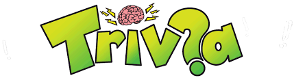

TRIVIA - GONZALO
================
El presente proyecto es acerca de una Trivia, consiste en hacerle preguntas al usuario, luego que se visualicen sus respuestas correctas e incorrectas.
Dicho proyecto fue realizado por Gonzalo en la semana de Pre-Selección de Laboratoria, para que las alumnas tengan un ejemplo como una de las posibles soluciones que  tiene el proyecto.
--------------------------------------------------------------------------------

